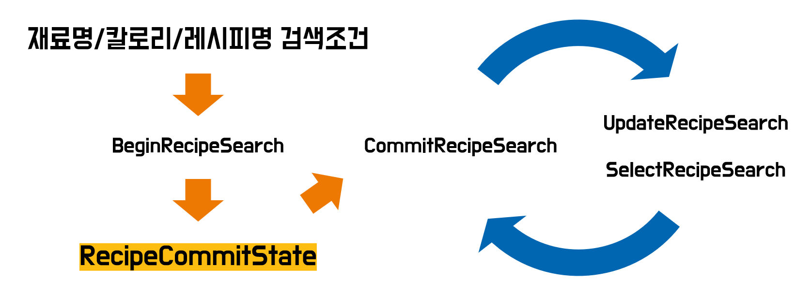

# 요리보고


   

"안녕하세요. 개발자에겐 즐거움을, 사용자에겐 편리함을 선물하는 요리보고 팀입니다."


## 목차

1. [캡슐구조](#캡슐구조)
2. 캡슐설정
3. 사전(Dictionary)
4. 발화(Training)
5. 트랜잭션 흐름
6. 레이아웃
7. 에러 처리
8. HTTP 요청
9. 외부 어플리케이션 실행(App Launch)
10. 부록(Appendix)


## 캡슐구조
   캡슐은 크게 assets, code, models, resources 부분으로 나누져 있는데 assets 같은 경우에는 정적으로 사용되는 파일(이미지)이 저장되어있고, code 부분은 .js 파일들을 각 기능에 맞게 폴더를 만들어서 구성을 하였습니다. 이미지 파일만 있는 assets과 .js 파일이 있는 code을 제외하고 나머지 폴더들의 구조에 대해서 설명을 드리겠습니다.


### models

> 디렉토리 상세

- actions : /base, /exercise, /guide, /process, /recipe
- concepts : /api, /base, /commit, /exercise, /guide, /ingredient, /process, /recipe

> 설명

   `actions` 폴더에는 각 기능에 필요하는 액션들과  `concepts` 폴더에는 액션에서 사용될 모델타입들로 구성되어 있습니다. `base` 폴더에는 범용성이 높거나 독립적인 파일들이 있고 나머지 폴더들은 이름에 연관성이 있는 파일들을 포함시켜 만들었습니다. 


   concepts 같은 경우에는 structure라는 다수의 model들을 포함하는 타입이 존재합니다. 요리보고에서는 primitive type과 structure를 구분하기 위해 위와 같이 structure 라는 폴더를 만들어서 해당 폴더 안에 생성을 하여 관리를 용이하게 하였습니다.


### resources

> 디렉토리 상세

- base : endpoints.bxb
- ko-KR : training, /dialogs, /layouts, /transactions, /views, /voca, Yoribogo.hints.bxb, capsule-info.bxb, capsule.properties

> 설명

​	`ko-KR` 폴더는 한국어와 관련된 resources를 모아놓은 폴더입니다. 마켓 플레이스에서 해당 캡슐의 간단한 사용방법을 알려주는 `.hints.bxb` 와 발화를 학습하는 `training` 파일,  특정 발화에 대한 결과 화면을 구성하는 파일들을 모아 놓은 `layouts` , `views` 폴더, 동의어 처리나 특정 단어를 빅스비에게 학습시키 위한 단어파일을 모아놓은 `voca` 폴더 등으로 구성을 하였습니다.

​	`capsule.properties` 은 HTTP 요청에 필요한 서버의 주소, API 키값이나 권한 범위 등 캡슐을 구성할 때 필요한 값들을 저장할 수 있습니다. 이외의 파일들에 대해서는 [프로젝트 설정]() 부분에서 다시 언급하도록 하겠습니다.


## 캡슐설정

​	빅스비 캡슐을 개발하면서 필요하거나 도움이 되는 설정들에 대해서 말씀드리겠습니다.


### .hints.bxb

```javascript
 uncategorized{
   utterance (사용법 가르쳐줘)
   utterance (미역이랑 쇠고기 요리법 찾아줘)
   utterance (보쌈김치 레시피 보여줘)
   utterance (300칼로리 이상 레시피 보여줘)
 }
```

​	`hints.bxb` 파일 같은 경우에는 캡슐이 실제 마켓 플레이스에 업로드 되었을 때 사용자들에게 대표발화 예제로 보여줄 발화 리스트입니다. (제일 먼저 사용할 수 있는 발화들이기 때문에 충분한 테스트를 거쳐야합니다.) 위와 같이 입력한 후 캡슐이 마켓 플레이스에 등록 된다면 아래와 같이 확인 하실 수 있습니다.


​	`utterance(...)` 안에 넣은 발화 앞에 ***"요리보고에서, "*** 라는 문장이 들어간 것을 보실 수 있는데, 해당 부분은 캡슐 이름으로 `capsule.bxb` 에 입력한 별칭에 따라 자동적으로 들어가게 됩니다.


### capsule-info.bxb

```javascript
capsule-info {
  display-name (요리보고)
  ...
  dispatch-aliases{
   alias (요리 보고)
  }
  ...
```

`capsule-info.bxb` 파일은 캡슐의 별칭을 `dispatch-aliases{...}` 에 입력하여 정할 수 있습니다. 저희 캡슐 같은 경우에는 `요리 보고` 인데, 발음하기 어려운 단어들은 빅스비가 인식하기 어렵기 때문에 되도록이면 쉽고 간단한 별칭을 권장합니다.


### capsule.properties

​	캡슐 개발 도중 HTTP 요청을 하는 메소드가 많아지고 여러 파일로 나누어 지는 경우 긴 웹서버 주소를 번거롭게 계속 입력해야 합니다. 거기다가 외부 API까지 사용을 하게되면 key값을 어디에 저장할지도 고민하게 됩니다. 이럴때 전역적으로 사용할 수 있도록 선언해주는 파일이 있는데, 그게 바로 `capsule.properties` 입니다.

```javascript
## Set the config mode of this capsule
# capsule.config.mode=default

## Set configuration properties with `config.<mode>.<propertyKey>=<propertyValue>`
## Use mode `default` for fallback property values
# config.default.my.property.key=myValue 123

# URL 주소 예시
config.default.remote.url=http://example:1234/mywebserver/
```

 위 코드예시는 저희 요리보고에서도 사용중인 형식의 코드입니다. 위와 같이 선언을 해주고 실제 .js 파일에서는 아래와 같이 호출하여 선언한 변수를 전역변수처럼 사용할 수 있습니다.

```javascript
var config = require('config');
...
module.exports.ExampleMethod = function(){
  return http.getUrl(config.get('remote.url') + 'helloworld/', { format: 'json' });
}
```


### capsule.bxb

​	캡슐을 개발하기 위해서는 어떤 언어들에 대해서 서비스 할 것인지, 버전은 몇으로 하고 빅스비에서 제공하는 라이브러리 캡슐을 사용한다면 `capsule.bxb` 에 입력하시면 됩니다.

```javascript
capsule {
  id (mycapsule)
    
  # 캡슐 등록시 동일한 버전으로는 업로드를 할 수 없습니다.
  # 등록하실때 주의하세요!
  version (1.2.3)
  format (3)
    
  # 어떤 언어를 서비스 할 것인지 선택 합니다.
  targets {
    target (bixby-mobile-ko-KR)
  }
   
  # 해당 캡슐이 어떤 범주에 들어가는지 입력합니다.
  store-sections{
    section (FoodAndDrink)
  }
    
  ...

  # 빅스비에서 지원하는 캡슐 라이브러리를 사용하고 싶으시면
  # 아래에 선언하시면 됩니다.
  capsule-imports {
    import (viv.core) { 
      as (core) 
    }
    ...
  }
}
```

​	`id` 는 `Bixby Developer Center`에서 설정한 팀이름이 들어가게 됩니다. 버전 부분은 위에 주석으로 나와있지만 한 번 올라간 버전으로는 다시 등록을 할 수 없습니다. `store-sections` 부분은 개발 중인 캡슐의 카테고리에 맞게 선택하시면 되는데 종류는 아래와 같습니다.

> 상점 섹션 종류

- `ArtAndLifestyle`
- `BusinessAndFinance`
- `Communication`
- `EducationAndReference`
- `FoodAndDrink`
- `GamesAndFun`
- `HealthAndFitness`
- `Local`
- `MoviesAndTV`
- `MusicAndAudio`
- `NewsAndMagazines`
- `Photography`
- `Productivity`
- `Shopping`
- `Sports`
- `TravelAndTransportation`
- `Weather`


​	`capsule-imports` 부분은 빅스비에서 제공하는 라이브러리와 같은 캡슐을 사용할때 선언을 하는 부분입니다. 자세한 정보는 https://bixbydevelopers.com/dev/docs/dev-guide/developers/library 를 참조해주세요.


## 사전(Dictionary)

​	사전을 구축하기 위해 사용할 수 있는 문자열 컨셉은 총 3가지로 `enum`, `name`, `text` 입니다. 아마 개발하면서 세 개의 타입 중에서 어떤 것을 선택해야할지 많은 고민을 하실거라고 예상 됩니다. 저희도 역시 어떤 것을 사용해야 적절한지 혼동이 왔었는데 나름대로 정리한 내용을 이야기 해드리겠습니다.


|                 enum                 |                          name                          |                         text                          |
| :----------------------------------: | :----------------------------------------------------: | :---------------------------------------------------: |
|             Closed type              |                       Open type                        |                       Open type                       |
| 한정된 범위로, 나열이 가능할 때 사용 | 일부는 나열을 할 수 있으나, 전부 나열이 불가능 한 경우 | 메시지 내용이나 일정 제목과 같이 예측이 불가능한 경우 |
|            Vocab이 필수적            |                    Vocab이 선택사항                    |                 Vocab을 가질 수 없음                  |


### enum

> 관련 파일

- ko-KR/voca : AddKeyword.vocab.bxb, RemoveKeyword.vocab.bxb, SearchKeyword.vocab.bxb, LowerBoundKeyword.vocab.bxb, UpperBoundKeyword.vocab.bxb, SortingOption.vocab.bxb, RecipeKeyword.vocab.bxb

​	`enum`을 사용하는 한 가지 예시를 들어보자면 **`국내 프로야구팀`**으로 들 수 있습니다. 바뀔 가능성이 적으며 명확하고 명시적으로 인지가 되는 데이터의 집합일 때, `enum`으로 처리를 하는 것이 좋습니다.


#### AddKeyword.vocab.bxb

```javascript
vocab(AddKeyword) {
  
  "추가해줘" {
    
    "추가해주세요",
    "추가해줄래",
    "추가해주라",
    "추가해",
    "추가해라",
    ...
   }
```

​	저희 요리보고는 재료를 추가할 때 사용하는 발화인 ***"추가해줘"*** 의 동의어들을 국립국어원에서 검색한 후 단어들을 `enum`형식으로 추가를 하였습니다.


### name

> 관련파일

- ko-KR/voca : Ingredient.vocab.bxb, RecipeName.vocab.bxb


​	예를들어 음식이거나 컴퓨터 주변기기 등 의미는 명확하지 않지만 너무 많아서 모든 것들을 다 나열할 수 없는 경우면 어떻게 해야할까요? 이럴 때 사용해야하는 모델이 바로 `name`입니다. 일부는 나열이 가능하지만, 해당하는 단어가 너무 많아서 전부 나열이 불가능한 경우 `name`이 효과적인 방법입니다.

​	`name`의 경우 enum과는 다르게 Vocab이 반드시 필요하지 않으나, Vocab에 추가하는 경우 빅스비에게 추가적인 hint를 줌으로써 태깅 성능을 높힐 수는 있습니다. 

​	요리보고 처럼 `음식`을 예로들자면 `치킨, 짜장면, 햄버거` 등 수많은 음식 데이터가 들어갈 수 있을텐데요. 과연 지구상에 존재하는 모든 음식의 이름에 대해서 발화를 하나하나 입력할 수 있을까요? 불가능 합니다. 그래서 해결 방법으로 `out of vocab training` 이라는 기법을 사용할 수 있습니다.

#### Ingredient.vocab.bxb

```javascript
vocab(Ingredient){
    "김치",
    "돼지고기",
    ...
}
```

​	위와 같이 `vocab('모델명')`을 선언하여 데이터를 입력하고 발화 트레이닝을 할 때 구분이 되는 문자 앞에 단어를 `name` 모델로 선언함으로써 모든 데이터에 대해 발화를 만들 필요가 없게 됩니다. 자세한 것은 ***"재료명으로 검색하기"*** 에서 언급하도록 하겠습니다.


### text

​	`text`는 위의 두 개로도 도저히 데이터의 형태를 정할 수 없을 때 사용하는 모델입니다. 예로들어 `알람설정`이라는 키워드에 대해서 어떤 사람은 ***"내일 8시 30분 회사가야해?"*** 라고 하고 다른 사람은 ***"내일 일정"*** 이라고 하는 것 처럼 발화 그룹에 들어올지 말지도 모르겠고 사이즈도 명확하지 않다고 할 때 `text` 타입을 사용하시면 됩니다.  `text`는 어떠한 값이든 가능하므로 미리 예측할 수 없는 경우 사용하는 것을 권장하고 있습니다. 또한, enum, name과 다르게 vocab을 가질 수 없습니다. (저희 요리보고에서는 text의 기능은 사용하지 않았습니다.)


## 발화(Training)

​	빅스비 캡슐 개발에서 가장 중요한 부분을 차지하는 영역은 발화라고 생각합니다. 그 이유는 빅스비 캡슐 자체가 대화형 플랫폼이며 모든 기능의 시작이 발화이기 때문입니다. 이번 파트에서는 발화에 대해서 요리보고를 개발하며 마주쳤던 문제들이나 어떤식으로 개발을 하였는지에 대해 기술하겠습니다.


### 재료명으로 검색하기

​	요리보고는 특정 재료들을 가지고 어떤 요리를 할 수 있는지 보여주는 기능을 가지고 있는데 쉽게 말해서 발화를 통해 입력된 재료들로 검색한다고 생각하시면 됩니다. 


#### 대표발화

> 발화 예시

1. "**돼지고기랑 김치랑 대파 레시피 보여줘**"
2. "**가쓰오부시랑 청포도랑 귤이랑 강낭콩 하는법 조회해줘**"
3. "**누룽지랑 쇠고기랑 양파 만드는 법 검색해**"

​	위의 세 발화는 전부 다른 발화처럼 보이지만 일정한 패턴이 있습니다. 재료명으로 검색하기 위한 발화는 아래와 같습니다.


> 패턴 - [재료]랑 [재료] [레시피] [보여줘]

**(돼지고기)[v:Ingredient]**랑 **(김치)[v:Ingredeint]**랑 **(대파)[v:Ingredient]** **(레시피)[v:RecipeKeyword:레시피]** **(보여줘)[v:SearchKeyword:검색]**  

  

​	요리보고에서 `SearchKeyword`와 `RecipeKeyword`를 따로 `enum` 으로 만들어 발화를 구성한 이유는 **중복발화를 제거**하기 위함입니다. ***"보여줘"*** , ***"조회해줘"*** , ***"검색해"*** 발화들의 의미는 크게 다르지 않습니다. 모두 똑같은 결과를 내놓는데 굳이 각 단어에 대한 발화를 세 개나 만들 필요가 있을까요?  마찬가지로 ***"하는법"***, ***"만드는 법"*** 모두 "***레시피"*** 와 의미가 동일합니다. 그래서 저희는 이런 부분을 `enum` 으로 처리하여 `vocab(...)` 에 정리를 하였습니다. 이 패턴은 하나의 발화로 동일한 문장 구조 내 유의어 처리를 가능하게 합니다.


### 레시피명으로 검색하기

​	위와 반대로 사용자가 재료가 아닌 음식명으로도 검색을 원할수도 있겠다라고 생각을 했습니다. 그래서 메뉴명으로 발화하여 검색할 수 있는 기능도 추가하였습니다.


#### 대표발화

> 발화 예시

1. "**삼계탕 레시피 검색해줘**"


> 패턴 - [레시피명] [요리법] [보여줘]

 **[g:CommitRecipeSearch,r:BeginRecipeSearch] (삼계탕)[v:RecipeName] (레시피)[v:RecipeKeyword:레시피] (검색해줘)[v:SearchKeyword:검색]**


​	레시피명 발화도 [재료명으로 검색하기]()와 유사하지만 입력되는 모델이 다릅니다. 레시피명은 `RecipeName` 으로 입력되게 하여 구분했고, 레시피에 관련된 발화들을 하나의 액션과 트랜잭션에서 처리하여 흐름을 단순화 시켰습니다.


### 칼로리로 검색하기

​	요리보고는 다른 요리앱과 달리 선택된 음식의 칼로리를 모두 소모하기 위해서는 운동을 얼마나 해야하는지를 알려주는 기능이 있습니다. 이 기능을 조금 더 편하게 사용할 수 있도록 하고 칼로리에 맞게 요리를 하고 싶은 사용자를 위해 칼로리를 기준으로 검색할 수 있는 발화를 추가하였습니다.


#### 대표발화

​	***"레시피"*** 는 선택으로해서 발화할 때 넣어도되고 안 넣어도 되도록 구현하였습니다.


> 발화 예시

- "**300 칼로리 이상 700 칼로리 미만 레시피 찾아줘**"
- "**500 칼로리 이상 요리법 보여줘**"
- "**300 칼로리 미만 조회해줘**"
- "**칼로리 200에서 300사이 보여줘**"


> 패턴 - [200] 칼로리 [이상] [300] 칼로리 [이하] {레시피} [보여줘]

**[g:CommitRecipeSearch,r:WrapBoundaryOption,r:BeginRecipeSearch] (300)[v:LowerBound] 칼로리 (이상)[v:LowerBoundKeyword:이상] (700)[v:UpperBound] 칼로리 (미만)[v:UpperBoundKeyword:이하] (레시피)[v:RecipeKeyword:레시피] (찾아줘)[v:SearchKeyword:검색]**

​	

​	칼로리 검색은 입력패턴이 다양하기 때문에, 이상/이하가 없는 문장도 발화로 넣어서 다양한 시나리오를 커버하도록 했습니다.


### Issue

#### 빅스비 학습

​	위에서 같은 문장구조 내의 유의어는 `enum` 타입을 통해 처리한다고 말씀드렸습니다만, 각 단어를 한 번씩은 발화로 트레이닝을 시켜주어야만 빅스비가 인식할 수 있습니다. 예제를 통해서 자세하게 말씀드리겠습니다.


> 예시

- 쇠고기랑 미역 레시피 보여줘

  - 쇠고기랑 미역 요리법 알려줘

  - 쇠고기랑 미역 만드는 법 가르쳐줘


​	위에서 ***"쇠고기랑 미역 레시피 보여줘"*** 의 발화 결과와 1, 2번의 발화 결과가 같고 동적으로 변하는 값은 ***"쇠고기"*** 랑 ***"미역"*** 입니다.  이럴경우 ***"레시피"***, ***"보여줘"*** 를 `enum` 타입으로 선언하여 비슷한 동의어를 `voca` 에 정의하면 동의어 수만큼 발화를 추가할 필요가 없지만 한 번은 입력을 해주셔야 합니다.

​	만약 위의 세 개의 발화에 대해 학습이 되어있다고 가정하면 ***"쇠고기랑 미역 레시피 보여줘"*** 형태는 유지하되 ***"쇠고기"***, ***"미역"*** 부분은 어떤 재료가 되든 상관없고 바뀐 재료에 ***"요리법 알려줘"***, ***"만드는 법 가르쳐줘"*** 로 구성된 발화는 굳이 추가안해도 빅스비가 학습했기 때문에 이해할 수 있습니다. 하지만 동의어로 ***"조리과정 조회해줘"*** 의 경우에는 아직 학습을 못했기 때문에 `voca` 에 있다고 해도 빅스비가 이해못하게 됩니다.

​	결론은 동적으로 바뀌는 부분은 제외하고 정적인 부분에 대해서는 `enum` 을 통해 동의어를 `voca  ` 에 정의한 후 저장되어 있는 동의어에 대해 한 번씩은 빅스비에게 가르쳐줘야 합니다.


#### 숫자와 문자 인식

​	캡슐 개발을 하면서 빅스비가 가끔씩 문자와 숫자를 혼동하여 인식하는 경우가 발생하였습니다. 한가지 예가 바로 ***"오이"*** 라는 단어인데요. 자꾸 빅스비가 ***"오2"*** 라고 인식하는 바람에 조금 난감했던 적이 있습니다. 이럴 때는 발화를 추가할 때 ***"오이"*** 라는 단어를 꼭 넣어서 학습을 시켰더니 인식률이 많이 올라갔습니다.


#### 구분자

​	발화를 트레이닝 하다가 보면 빅스비 학습 패턴을 알 수 있는데, 학습한 데이터를 토대로 구분자를 통해 문장에서 필요한 단어만 추출을 합니다. 예로들어서, ***"피망이랑 버섯이랑 양파 레시피 알려줘"*** 라는 발화를 학습 시켰을 때 빅스비는 ***"이랑"*** 이라는 단어를 구분자로 추가를 합니다. 그 다음 ***"오이랑 대파 레시피 알려줘"*** 라고 했을 때 ***"오이"***, ***"대파"***를 추출 하는 것이 아니라 ***"오"***, ***"대파"***를 추출하는 상황이 발생합니다. 이런 경우를 대비하여서 혼동이 올 수 있는 문장들에 대해 꼭 트레이닝을 하시고 다양한 패턴의 발화를 추가하는 것이 중요합니다.


## 트랜잭션 흐름

​	보통 검색은 트랜잭션 타입이 아닌 검색 타입으로 구현하지만, 요리보고에서는 레시피 검색 도중 이전 상태를 함께 활용하여 현재 입력된 발화(명령)를 처리하기위해 트랜잭션을 사용하였습니다.  현재 `재료명을 이용한 레시피 검색` 기능 에서 검색 조건으로 재료를 추가하거나 제거할 때와 `선택된 레시피에 대한 요리과정 화면 출력` 기능에서 각 요리과정을 단계적으로 보여줄때 활용하고 있습니다. 


### 레시피 검색

> 관련 파일

- actions/recipe : BeginRecipeSearch.model.bxb, CommitRecipeSearch.model.bxb, UpdateRecipeSearch.model.bxb, SelectRecipeSearch.model.bxb
- concepts/commit : RecipeCommitState.model.bxb
- views/recipe : RecipeConfirmation.view.bxb, RecipeList.view.bxb

> 설명

​	사용자 입력 발화가 들어왔을 때 레시피 검색 트랜잭션 전체흐름입니다. [4. 발화]() 언급했듯이 요리보고에는 레시피 검색에 대해 총 3종류의 발화( `재료명을 이용한 레시피 검색` , `레시피명을 이용한 레시피 검색` , `칼로리를 이용한 레시피 검색` ) 가 존재하며, 이 발화들은 공통적으로 아래의 흐름을 따라갑니다. 


​	발화는 BeginRecipeSearch을 거쳐서 CommitRecipeSearch로 가게 되는데, 레시피 검색 트랜잭션 전체를 의미하고 사용자가 최종 레시피 하나를 선택하기 전까지 종료되지 않습니다. UpdateRecipeSearch는 트랜잭션 도중 조건을 다르게 하여 검색하고 싶을 때 사용되는데 현재는 `재료명을 이용한 레시피 검색`에서 재료를 추가하거나 제거 하는데 주로 활용되고 있습니다. 아래는 예시 발화입니다. 

1. ***"양파랑 돼지고기를 이용한 요리법 검색해줘"***
2. ***"양파 빼고 검색해줘"***
3. ***"김치 추가해서 검색해줘"***

​	SelectRecipeSearch는 검색된 레시피 중 하나에 대한 상세정보를 보고싶을 때 사용됩니다. 레시피 검색 트랜잭션 전반에 걸쳐 유지되는 RecipeCommitState는 현재 검색 조건 상태를 가지고 있는 구조체로, 발화 사이에 문맥을 만들어 주는 역할을 합니다. RecipCommitState는 다음과 같은 흐름을 따릅니다.



​	위 그림에서 RecipeCommitState는 BeginRecipeSearch에서 생성되어 CommitRecipeSearch - UpdateRecipeSearch 사이클에 주입된 후, 하나의 CommitRecipeSearch가 끝날 때까지 유지되며 입력된 사용자의 발화에 따라 작업을 처리합니다.


### 요리과정 보기

> 관련 파일

- actions/process : BeginProcessShow.model.bxb, CommitRecipeShow.model.bxb, UpdateRecipeShow.model.bxb
- concepts/commit : ProcessCommitState.model.bxb
- views/process : ProcessConfirmation.view.bxb

> 설명

​	아래의 그림은 사용자가 레시피 검색을 통해 최종적으로 요리를 선택했을 때, 해당 요리에 대한 요리과정을 보기 위한 트랜잭션 전체흐름입니다. 


​	레시피 검색과 마찬가지로 CommitProcessSearch는 요리과정 보기에 대한 트랜잭션 자체를 의미합니다. UpdateProcessSearch는 요리과정을 단계적으로 보여줄 때 사용하는데, 사용자는 ***"다음"*** 혹은 ***"이전"*** 발화를 이용하여 이전 단계 혹은 다음 단계의 요리과정으로 넘어갈 수 있습니다. 레시피 검색 트랜잭션과 마찬가지로 요리과정 트랜잭션을 처리하기 위한 상태를 저장하는 ProcessCommitState가 유지되며, 이 구조체를 활용하여 사용자의 발화(명령)을 처리합니다.


## 에러 처리(Error Handling)

​	빅스비 동작에서 필요한 부분은 크게 3가지로 Concept, Action, Code(Javascript) 입니다. 여기서 명령을 정의하고 수행하는 부분은 Action과 Code이기 때문에 에러도 이 2곳에서 처리합니다. 실제 필요한 명령을 수행하는 부분인 Code에서 에러를 프로그래밍적으로 발생시키고, Action에서는 발생된 에러 종류에 따라 처리 방법을 정의합니다.


> 관련 파일

- actions/recipe : BeginRecipeSearch.model.bxb
- code/recipe : BeginRecipeSearch.js


#### BeginRecipeSearch.js

```javascript
var fail = require('fail');

if(db == undefined || db.length == 0){
    // 예외를 발생시키는 부분
    throw fail.checkedError('There is no process', 'NotFoundRecipes', null);
}
```


#### BeginRecipeSearch.bxb

```javascript
//발생한 에러는 action의 output에서 처리한다.
output (RecipeCommitState){
    throws{
        //BeginRecipeSearch.js에서 throw를 통해 던질 때 정의한 이름
        error (NotFoundRecipes){
            on-catch{
                // 캡슐 동작을 정지함
                halt{
                    // 상단에 노출되는 메시지
                    dialog("레시피를 찾을 수 없습니다.")
                }
            }
        }
        //그 외 에러
        unknown-error{
            on-catch{
                halt{
                    dialog("예기치 못한 오류가 발생했습니다.")
                }
            }
        }
    }
}
```


> 참고자료

- Error Handling 관련 자료

  https://bixbydevelopers.com/dev/docs/sample-capsules/samples/error-handling


## HTTP 요청(Http Request)

​	빅스비에서 Http Request를 사용하기 위해서는 캡슐에서 제공하는 라이브러리를 사용해야합니다.


> 관련 파일

- code/lib : tool.js


#### tool.js

```javascript
module.exports.searchRecipeByName = function(recipeName){
  let queryName = recipeName.replace(' ', '');
  // 전송에 필요한 설정, 파라메터들을 위한 객체
  let options = {
    //파라메터
    query : {
      recipeName : queryName
    },
    format : "json"
  };
  return http.getUrl(config.get('remote.url') + 'foodBasic/searchByRecipeName', options);
}
```


> 참고자료

- HttpRequest

  https://bixbydevelopers.com/dev/docs/sample-capsules/samples/http


## 외부 어플리케이션 실행

​	빅스비에서 외부 어플리케이션을 호출하려면 App launch를 호출해야합니다. App launch는 어플리케이션을 호출하면서 빅스비를 종료하는데, 이는 현재 **프로그래밍적으로 빅스비를 종료시킬 수 있는 유일한 방법**이기도 합니다. 요리보고에서는 App launch를 이용하여 선택된 레시피에 대한 유튜브 동영상을 브라우저로 띄워주는 기능이 구현되어 있습니다. 동영상 URL은 Youtube API를 이용하였으니 API에 대한 사용방법은 이곳을 참고해주시면 감사하겠습니다.


> 관련 파일

- actions/process : CommitProcessShow.model.bxb
- concepts/api : YoutubeResult.model.bxb
- views : UrlLauncher.view.bxb


#### UrlLauncher.bxb

```javascript
//ResultView에서 사용  
app-launch{
  //연결하고자 하는 브라우저 URL
  payload-uri("#{value(this.url)}")
}
```


> 참고자료

- App-launch

  https://bixbydevelopers.com/dev/docs/reference/type/result-view.app-launch


## 부록

### Youtube API

​	인코딩된 검색어를 parameter로 넣어 Youtube 서버로 전송을 하면 JSON 형태로 검색결과를 받을 수 있는 API 입니다. 반환되는 결과에는 thumbnail 뿐만 아니라 동영상에 대한 설명 등 필요한 데이터만 추출하여서 사용하실 수 있습니다. Youtube Search API를 사용할 수 있는 방법은 두 가지 방법이 있습니다.

---------------------

1. API Key를 이용하여 단순 검색
2. OAuth 인증을 통하여 사용하는 방법

----------------------

​	이렇게 두 가지 방법이 있는데, OAuth 같은 경우에는 Google 로그인과 같은 써드 파티 사용이 가능한 점이 있지만 저희 캡슐에서는 로그인이나 사용자 정보를 사용할 필요가 없었기 때문에 API Key를 이용하여 간단하게 쿼리를 전송하고 결과를 받는 형식으로 개발을 하였습니다.


#### JAVA 예제

​	아래에 보시면 URL 주소가 있는데 들어가보시면, 예제들을 확인할 수 있는데 JAVA언어로 작성된 sample code가 있습니다. 해당 코드의 핵심적인 부분만 설명을 드리겠습니다.


##### API Key

```java
/** Global instance properties filename. */
private static String PROPERTIES_FILENAME = "youtube.properties";

// youtube.properties
# Replace this with an API key available at
# https://console.developers.google.com/project/_/apiui/credential
youtube.apikey=값을 입력하시면 됩니다.
```

​	위의 코드는 Google Cloud Platform에서 발급받은 API Key를 `youtube.properties` 파일에 넣어줌으로써 사용하실 수 있습니다. 인증된 값을 정확하게 입력하게 되면 정상적으로 작동하는 것을 볼 수 있습니다.


##### Part

```java
YouTube.Search.List search = youtube.search().list("id,snippet");
```

​	Youtube API에 쿼리를 보낼때 필수적으로 포함되어야 하는 parameter가 있는데 바로 `Part` 입니다. 실제로 공식문서에서도 `Part`를 제외한 모든 부분은 선택인 것에 반해 `Part` 부분은 필수영역으로 지정되어 있습니다. 위의 code를 보시면 `id, snippet` 이라는 것을 확인하실 수 있는데, `Part` 에 id만 주게되면 `videoId, etag` 와 같은 key 값 정도만 받아보실 수 있고, `Part`에 snippet을 주게되면 `videoId` 를 포함한 `title, description` 과 같은 동영상에 대한 여러가지 정보들을 JSON 형식으로 받아볼 수 있습니다.


##### 값 추출

```java
private static void prettyPrint(Iterator<SearchResult> iteratorSearchResults, String query) {

    //불필요한 출력문 생략
    .....

        if (!iteratorSearchResults.hasNext()) {
            System.out.println(" There aren't any results for your query.");
        }

    while (iteratorSearchResults.hasNext()) {

        SearchResult singleVideo = iteratorSearchResults.next();
        ResourceId rId = singleVideo.getId();

        // Double checks the kind is video.
        if (rId.getKind().equals("youtube#video")) {
            Thumbnail thumbnail = singleVideo.getSnippet().getThumbnails().get("default");

            System.out.println(" Video Id" + rId.getVideoId());
            System.out.println(" Title: " + singleVideo.getSnippet().getTitle());
            System.out.println(" Thumbnail: " + thumbnail.getUrl());
            ...
        }
    }
}
```

   위에서 properties에 적절한 key 값을 넣었다면 기본값인 `YouTube Developers Live`의 검색결과가 반환되는 것을 확인하실 수 있습니다. 그렇다면 우리가 원하는 검색 결과를 얻기 위해서는 어떻게 해야할까요? 위에 `prettyPrint` method의 parameter를 살펴보면 `iteratorSearchResults`를 통해 검색결과를 iterator 형식으로 받아볼 수 있고 key들이 모두 get method가 만들어져 있기 때문에 아주 편하게 값을 얻을 수 있습니다.


> 참고 자료

- Youtube API

  https://developers.google.com/youtube/v3/docs/search/list?hl=ko

- Google Cloud Platform

  https://cloud.google.com/

- OAuth 2.0

  https://opentutorials.org/course/3405


